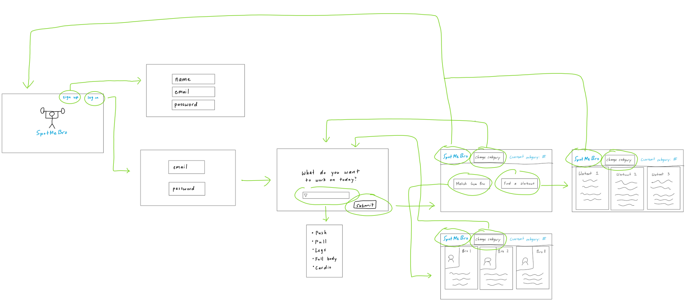

# spot-me-bro

## Table of contents
<!-- Commented out items are ones used in bowfolios that we currently do not have the capabilities to complete with
the current version of the project (11/11/24) -->
<!-- Commented out items are ones used in bowfolios that we currently do not have the capabilities to complete with
the current version of the project (11/11/24) -->
* [Overview](#overview)
<!-- * [Deployment](#deployment) -->
<!-- * [Deployment](#deployment) -->
* [User Guide](#user-guide)
<!-- * [Community Feedback](#community-feedback) -->
<!-- * [Developer Guide](#developer-guide) -->
<!-- * [Community Feedback](#community-feedback) -->
<!-- * [Developer Guide](#developer-guide) -->
* [Development History](#development-history)
<!-- * [Continuous Integration](#continuous-integration) -->
<!-- * [Walkthrough videos](#walkthrough-videos) -->
<!-- * [Example enhancements](#example-enhancements) -->
* [Mockup](#mockup)
<!-- * [Continuous Integration](#continuous-integration) -->
<!-- * [Walkthrough videos](#walkthrough-videos) -->
<!-- * [Example enhancements](#example-enhancements) -->
* [Team](#team)

## Overview

spot-me-bro is a platform designed to help students find gym partners based on their fitness level, experience, and goals. Whether you’re a beginner looking for guidance or an advanced gym-goer looking for a partner to push you to your limits, spot-me-bro aims to make your workout experience more engaging and productive.
spot-me-bro is a platform designed to help students find gym partners based on their fitness level, experience, and goals. Whether you’re a beginner looking for guidance or an advanced gym-goer looking for a partner to push you to your limits, spot-me-bro aims to make your workout experience more engaging and productive.

### Key Features

1. Gym Partner Matching: Match users with others based on their fitness level, experience, and workout preferences.
2. Profile Customization: Users create and manage their profiles, including fitness goals and availability.
3. Workout Plans (Extra feature): Optionally, users can browse workout plans based on their fitness goals.

### Technology Used

* [Node.js](https://www.nodejs.com/) for Javascript-based implementation of client and server code.
* [React](https://reactjs.org/) for component-based UI implementation and routing.
* [React Bootstrap](https://react-bootstrap.github.io/) CSS Framework for UI design.
* [Uniforms](https://uniforms.tools/) for React and Semantic UI-based form design and display.
* [Postgresql](https://www.postgresql.org/) for sql database management

### User Guide
Users will be able to create a profile that shows their abilities in 5 different categories (Push, Pull, Legs, Full Body, Cardio). Once a user is registered, they can log into the application and will be prompted as to what type of workout they are interested in doing today. The application will then match users with similar capabilities and interests together and provide them with each other’s contact information.

### Mockup
Here is a sketch of our ideas for some basic page layouts and page flow:

### Development History
Dev log (11/11/24)
We are in the brainstorming and design phase of spot-me-bro, development has not officially begun. We have laid out what we would like the application to do and have a mockup of a few pages that will need to be made.

### Team
spot-me-bro is designed and implemented by, Ashton Aparra (ashtonaparra), Adeil Mohammadzadah (Adeilmo226), and Coen Bracilano (CoenBracilano).
