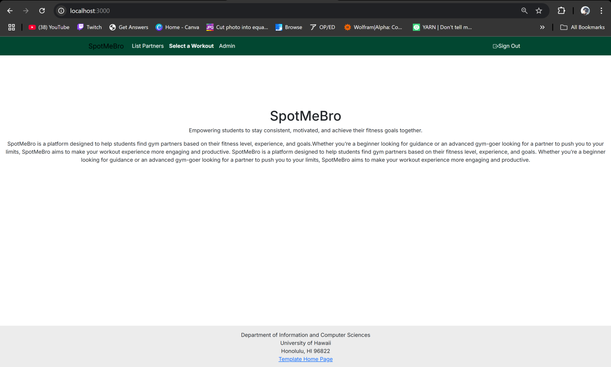
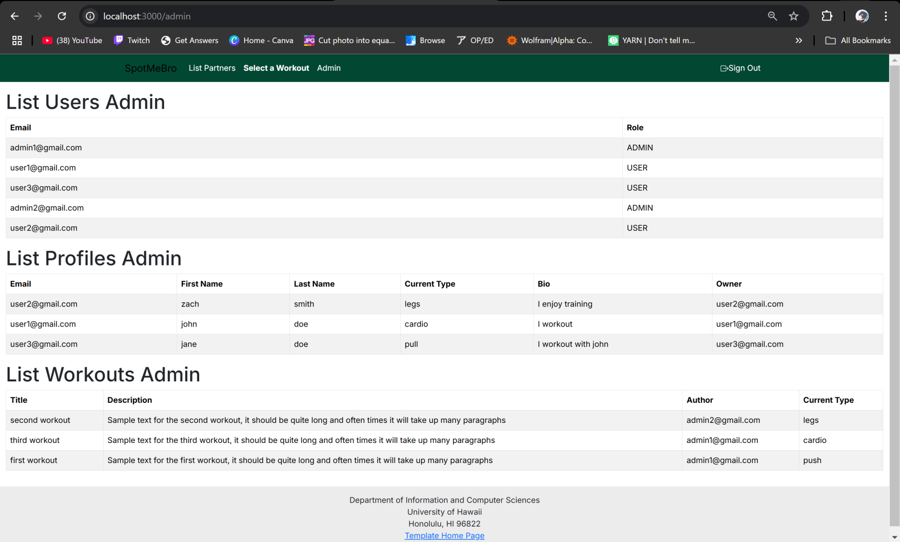
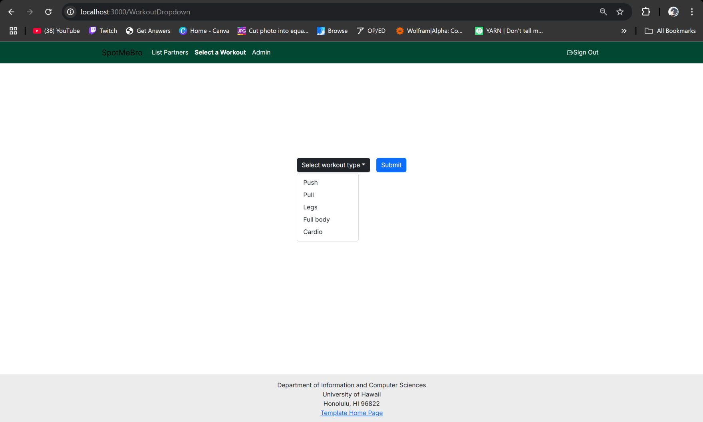

# SpotMeBro

[View Github Organization](https://github.com/spot-me-bro)

## Table of contents
* [Overview](#overview)
* [User Guide](#user-guide)
* [Development History](#development-history)
* [Mockup](#mockup)
* [Deployment](#Deployment)
* [Team Contract](#team-contract)
* [Team](#team)

## Overview

SpotMeBro is a platform designed to help students find gym partners based on their fitness level, experience, and goals. Whether you’re a beginner looking for guidance or an advanced gym-goer looking for a partner to push you to your limits, SpotMeBro aims to make your workout experience more engaging and productive.
SpotMeBro is a platform designed to help students find gym partners based on their fitness level, experience, and goals. Whether you’re a beginner looking for guidance or an advanced gym-goer looking for a partner to push you to your limits, SpotMeBro aims to make your workout experience more engaging and productive.

### Key Features

1. Gym Partner Matching: Match users with others based on their fitness level, experience, and workout preferences.
2. Profile Customization: Users create and manage their profiles, including fitness goals and availability.
3. Workout Plans (Extra feature): Optionally, users can browse workout plans based on their fitness goals.

### Technology Used

* [Node.js](https://www.nodejs.com/) for Javascript-based client and server code implementation.
* [React](https://reactjs.org/) for component-based UI implementation and routing.
* [React Bootstrap](https://react-bootstrap.github.io/) CSS Framework for UI design.
* [Uniforms](https://uniforms.tools/) for React and Semantic UI-based form design and display.
* [Postgresql](https://www.postgresql.org/) for SQL database management

### User Guide
Up-to-date screenshots showing the state of the project.

### Mockup
Here is a sketch of our ideas for some basic page layouts and page flow:

### Development History

#### Milestone #1:

[Here is the link to our M1 project page](https://github.com/orgs/spot-me-bro/projects/5)

For this Milestone, we set simple database models and pages/components.

#### Milestone #2:

### Deployment

SpotMeBro is deployed on vercel [here](https://spot-me-bro-nextjs-49w2lafmj-adeil-mohammadzadahs-projects.vercel.app/).

### Team Contract

Team Contract can be found [here](https://docs.google.com/document/d/1R3GT8Ti9fhLgFd88CLp2sHaLnCis-MX7W9F1UdYqiRk/edit?tab=t.0#heading=h.9odkc9kfj5rj).

### Team
SpotMeBro is designed and implemented by, Ashton Aparra (ashtonaparra), Adeil Mohammadzadah (Adeilmo226), and Coen Bracilano (CoenBracilano).
